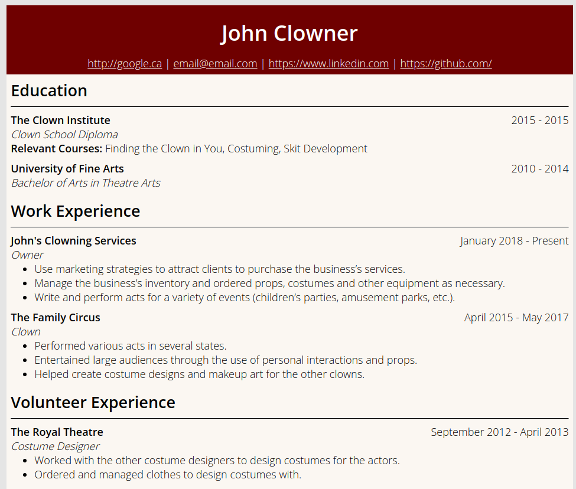

# Plain Resume
This is a Jekyll theme for creating a simple and customizable resume. This could be used to digitally present your resume online and have it be accessible to anyone who is interested in it. 



## How to Install the Theme

1. Clone the repository.
2. Run `bundle exec jekyll serve`.
3. If it compiles successfully, you can now see your resume.

## Adding Data to the Resume
The resume loads data from the `_data` files. In this folder, you will find .yml files. This is where you will be adding entries to display on your resume.

All entries for each section begin with a `-`. Each line then follows a `key:value` format. Please see the existing .yml files for examples.


## Section Layouts
Section layouts can be found in the `_includes` folder. Unless you know what you are doing, you usually do not want to modify these files. 

Typically, a section layout will look something like this.

```
<div class="resume-content">

    
    
    <h2>Awards</h2>
    <hr>
    
    
    <div class="entry">
        <h4 class="title">{{ award.title }}</h4>
        <h4 class="date">{{ award.time }}</h4>
        <ul>
            <li>{{ award.description }}</li>
        </ul>
    </div>
    
    
    
    
    
</div>
    
```

## Adding Your Own Sections
If you need a resume section which has not been created yet. Follow these steps. 

1. Create a `.yml` file for your data in the `_data` folder.
2. Fill in the data.
3. Create a `.html` file in the `_includes` folder.
4. Create a layout with respect to the rest of the template.
5. Include it in the default.html file in `layouts`.

## CSS

You can edit the CSS in theme.css.  